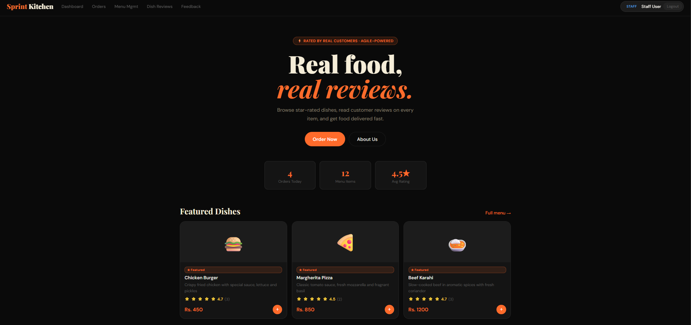

# Sprint Kitchen — Web Application

> A modern, full-featured restaurant ordering and management system built as a single-page web application.

**Team:** Sprint Innovators  
**Members:** Shayan (22K-4148) · Muhammad Umer (22K-4160) · Ibrahim (22K-4173) · M Saad Yousuf (22K-4572)

**Live demo:** [shayannoorullah.github.io/Sprint-Kitchen](https://shayannoorullah.github.io/Sprint-Kitchen/)



---

## Table of Contents

1. [Project Overview](#project-overview)
2. [Technology Stack](#technology-stack)
3. [Project Structure](#project-structure)
4. [Quick Start](#quick-start)
5. [Deployment](#deployment)
6. [Configuration — EmailJS](#configuration--emailjs)
7. [Demo Accounts](#demo-accounts)
8. [Feature Guide](#feature-guide)
   - [Customer Features](#customer-features)
   - [Staff Features](#staff-features)
   - [Admin Features](#admin-features)
9. [Data Storage](#data-storage)
10. [Known Limitations](#known-limitations)

---

## Project Overview

Sprint Kitchen is a client-side Single-Page Application (SPA) that simulates a complete food ordering platform. It provides:

- A **customer-facing storefront** for browsing, ordering, and tracking food.
- A **staff portal** for managing orders, the menu, customer reviews, and feedback.
- An **admin portal** that extends the staff portal with user management.
- **Automated email notifications** via EmailJS when an order is delivered and after feedback is submitted.

All application logic runs in the browser. Data is held in-memory for the current session and persisted to `localStorage` for accounts, sessions, and orders.

---

## Technology Stack

| Layer | Technology |
|-------|-----------|
| Structure | HTML5 |
| Styling | CSS3 (custom properties, flexbox, grid, animations) |
| Logic | Vanilla JavaScript (ES6+) |
| Fonts | Google Fonts — Playfair Display, DM Sans |
| Email | EmailJS Browser SDK v4 |
| Storage | Browser `localStorage` |
| Hosting | Static file — no server required |

---

## Project Structure

```
Sprint-Kitchen/
├── assets/
│   └── Sprint_Kitchen.png             ← README screenshot
├── .github/workflows/
│   └── deploy.yml                     ← GitHub Pages CI/CD
├── Web Application/
│   ├── SprintKitchen_WebApp.html      ← Main application (open this in a browser)
│   ├── emailjs-config.js              ← Live API keys (gitignored — do not commit)
│   └── emailjs-config.example.js     ← Setup template (safe to commit)
├── scripts/
│   ├── prepare-deploy.sh              ← Builds deploy/ bundle (CI / Unix)
│   └── prepare-deploy.mjs             ← Builds deploy/ bundle (cross-platform)
├── Frontend/
│   └── Sprint_kitchen_Frontend.html  ← Early UI prototype (reference only)
├── netlify.toml                       ← Netlify config
├── vercel.json                        ← Vercel config
├── package.json                       ← Local preview scripts
├── .gitignore
└── README.md                          ← This file
```

---

## Quick Start

1. **Clone or download** the repository.
2. **Open** `Web Application/SprintKitchen_WebApp.html` in any modern browser (Chrome, Firefox, Edge).
3. **No build step, no server, no dependencies to install.** The app runs entirely in the browser.
4. Log in using one of the [demo accounts](#demo-accounts) or register a new customer account.

> For email notifications to work, complete the [EmailJS configuration](#configuration--emailjs) first.

---

## Deployment

Sprint Kitchen is a **static site** (no backend, no build step). It can be hosted on any static file host.

### Option A — GitHub Pages (recommended)

This repo includes a GitHub Actions workflow (`.github/workflows/deploy.yml`) that deploys automatically on every push to `main`.

**One-time setup (repo owner):**

1. Open **GitHub → Settings → Pages**.
2. Under **Build and deployment → Source**, select **GitHub Actions**.
3. Push to `main` (or run the workflow manually under **Actions → Deploy to GitHub Pages → Run workflow**).

**Live URL:** `https://<your-github-username>.github.io/Sprint-Kitchen/`

**Optional — live EmailJS on production:** Add these repository secrets under **Settings → Secrets and variables → Actions**:

| Secret | Description |
|--------|-------------|
| `EMAILJS_PUBLIC_KEY` | EmailJS public key |
| `EMAILJS_SERVICE_ID` | EmailJS service ID |
| `EMAILJS_TEMPLATE_ID` | Feedback-request template ID |
| `EMAILJS_CONFIRM_TEMPLATE_ID` | Feedback confirmation template ID |

**Full step-by-step guide:** [docs/EMAILJS_PRODUCTION_SETUP.md](docs/EMAILJS_PRODUCTION_SETUP.md)  
**Copy-paste email bodies:** [docs/email-templates/](docs/email-templates/)

If secrets are not set, the deployed app still works — email sends are simulated with a toast notification.

### Option B — Netlify

1. Sign in at [netlify.com](https://www.netlify.com) and **Import** this GitHub repository.
2. Netlify reads `netlify.toml` automatically (`publish = deploy`, build runs `node scripts/prepare-deploy.mjs`).
3. Add the same `EMAILJS_*` variables under **Site settings → Environment variables** (optional).

### Option C — Vercel

1. Import the repo at [vercel.com](https://vercel.com).
2. Vercel uses `vercel.json` — output directory `deploy`, build command `node scripts/prepare-deploy.mjs`.
3. Add `EMAILJS_*` environment variables in the project settings (optional).

### Local preview (before deploying)

```bash
npm run preview          # serves Web Application/ on http://localhost:3000
npm run preview:deploy   # builds deploy/ bundle then serves it (matches production layout)
```

---

## Configuration — EmailJS

Email sending (feedback request on delivery, confirmation after feedback) requires an EmailJS account.

> **Production (GitHub Pages):** Follow [docs/EMAILJS_PRODUCTION_SETUP.md](docs/EMAILJS_PRODUCTION_SETUP.md) for live email on the deployed site.

### Local setup

1. Copy the example config file:
   ```
   Web Application/emailjs-config.example.js  →  Web Application/emailjs-config.js
   ```
2. Sign in at [dashboard.emailjs.com](https://dashboard.emailjs.com) and fill in your values:

   ```javascript
   const EMAILJS_PUBLIC_KEY          = 'your_public_key';
   const EMAILJS_SERVICE_ID          = 'your_service_id';
   const EMAILJS_TEMPLATE_ID         = 'your_feedback_request_template_id';
   const EMAILJS_CONFIRM_TEMPLATE_ID = 'your_confirmation_template_id';
   ```

3. Create two email templates in your EmailJS dashboard:

   **Template 1 — Feedback Request** (sent to customer when order is delivered):

   | Variable | Value |
   |----------|-------|
   | `{{to_email}}` | Recipient email address |
   | `{{customer_name}}` | Customer's full name |
   | `{{order_id}}` | e.g. SK-500001 |
   | `{{order_items}}` | Comma-separated item list |
   | `{{order_total}}` | e.g. Rs.1249 |
   | `{{feedback_link}}` | Full URL with order, name, and email pre-filled |

   **Template 2 — Feedback Confirmation** (sent after customer submits feedback):

   | Variable | Value |
   |----------|-------|
   | `{{to_email}}` | Recipient email address |
   | `{{customer_name}}` | Customer's full name |
   | `{{order_id}}` | e.g. SK-500001 |
   | `{{rating}}` | e.g. 5/5 |
   | `{{comment}}` | The feedback comment text |

> If EmailJS is not configured, the application continues to work normally. A toast notification simulates the email send so you can test the full flow without a live EmailJS account.

---

## Demo Accounts

| Role | Email | Password | Access |
|------|-------|----------|--------|
| **Admin** | admin@sprintkitchen.pk | Sprint@Admin2025 | All pages + Staff Management |
| **Staff** | staff@sprintkitchen.pk | Staff@2025 | Dashboard, Orders, Menu, Reviews, Feedback |
| **Customer** | customer@sprintkitchen.pk | Customer@2025 | Home, Menu, About, Feedback |

You can also **register a new customer account** from the login modal. Credentials are saved to `localStorage` and will persist across page reloads.

---

## Feature Guide

### Customer Features

#### Browsing & Ordering
- **Home** — Hero banner, live stats (dishes, orders served, avg rating), featured dishes, and recent customer reviews.
- **Menu** — Full dish catalogue with category filter chips and a live search bar. Each dish card shows the price, average rating, and an "Add to Cart" button.
- **Dish Reviews** — Click any dish card to open a modal showing all customer reviews and a form to submit your own star rating and comment.
- **Cart** — Sliding cart panel showing all selected items with quantity controls, subtotal, and delivery fee.
- **Checkout** — Contact details, delivery/pickup selection, address fields, and payment method.
  - Payment options: **Cash on Delivery** or **Card Payment** (Visa / Mastercard). Both are required — the order cannot be placed without selecting one.
  - Card fields: cardholder name, card number (auto-formatted in groups of 4), expiry (MM/YY), CVV.

#### Order Tracking & Feedback
- **Success Page** — After placing an order you see the unique Order ID, a mini 4-step status tracker, and an email confirmation note.
- **Feedback Tab** — Lists all your past orders. For each order:
  - **Pending / Preparing / Ready** — a mini tracker shows the current status.
  - **Delivered (no feedback yet)** — a "Leave Feedback" button expands an inline star-rating + comment form.
  - **Delivered (feedback submitted)** — a green "Feedback Submitted" badge is shown.
- **Feedback via Email Link** — When your order is marked "Delivered" by staff, an email is sent containing a direct feedback link. Following the link opens the feedback form with Order ID, Name, and Email already filled in and locked — no login required.

#### Account
- **Register** — Name, email, and password (min 6 chars). Account saved to `localStorage`.
- **Login** — Email and password. Includes a show/hide password toggle (👁 icon).
- **Session persistence** — Logging in persists across page reloads via `localStorage`.
- **Auto-fill** — Checkout and feedback form fields are pre-populated from your account details when logged in.

---

### Staff Features

Staff log in with a staff account (created by an admin or the default seeded account).

#### Dashboard
- **KPI Cards** — Pending orders count, total revenue, average dish rating, total number of reviews.
- **Recent Orders** — Table showing the latest 4 orders with ID, customer, total, status, and payment.
- **Top Rated Dishes** — Top dishes ranked by average customer rating.
- **Recent Feedback** — Latest 3 customer feedback submissions.

#### Orders
- Full sortable table of all orders.
- **Status filter** — Filter by All / Pending / Preparing / Ready / Delivered / Cancelled.
- **Change Status** — Inline dropdown to move each order through the workflow. When status is changed to "Delivered", a feedback-request email is automatically sent to the customer.
- **Feedback Email Button** — Manually resend the feedback request email from the delivered order row.
- **Payment column** — Shows the payment method chosen by the customer (Cash on Delivery / Visa Card / Mastercard Card).

#### Menu Management
- View all menu items with category, price, rating, review count, featured status, and availability.
- **Toggle availability** — Enable or disable an item from being ordered.
- **Toggle featured** — Mark/unmark an item for the home page featured section.
- **Delete** — Permanently remove a menu item.
- **Add new item** — Form with name, category, price, emoji icon, description, featured, and available flags.

#### Dish Reviews
- View all customer reviews grouped or filtered by dish.
- Delete individual reviews.

#### Feedback
- View all submitted order-level feedback cards (customer name, star rating, comment, order ID, timestamp).

---

### Admin Features

Admins have all staff permissions plus:

#### Staff Management
- View all staff accounts.
- **Add new staff** — Name, email, and password. Saved to `localStorage`.
- **Delete staff** — Removes the account. The default admin account cannot be deleted.

---

## Data Storage

| `localStorage` Key | Contents | Persists |
|-------------------|---------|---------|
| `sk_session` | Currently logged-in user `{role, email, name}` | Until logout |
| `sk_customers` | Array of registered customer accounts | Permanent |
| `sk_staff` | Array of staff accounts | Permanent |
| `sk_orders` | Array of all placed orders with current statuses | Permanent |
| `sk_next_oid` | Last-used numeric order ID counter | Permanent |

> **Seed / demo data** (menu items, reviews, demo orders, demo feedback) is loaded from the JavaScript source each time the page loads. Real orders placed by users are merged on top from `sk_orders`.

---

## Known Limitations

| Limitation | Detail |
|-----------|--------|
| No backend | All data is in-memory + `localStorage`. Data is browser-specific and will be lost if `localStorage` is cleared. |
| No real payment processing | Card fields are collected for UI completeness only; no payment gateway is integrated. |
| Single browser | Multiple users cannot share data in real time — each browser has its own isolated state. |
| EmailJS free tier | The free EmailJS tier allows 200 emails/month. Exceeding this limit will cause email sends to fail silently. |
| Password storage | Customer passwords are stored in plain text in `localStorage`. This is acceptable for a prototype but must be hashed with bcrypt or similar before any production deployment. |
| MENU persistence | Menu changes (add/delete/toggle) are in-memory only and reset on page reload. |
